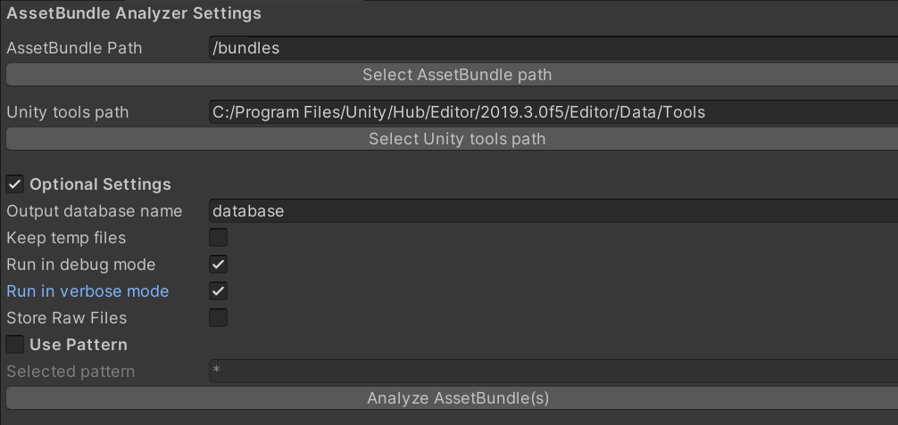

# Asset Bundle Analyzer Package
## com.unity.support.asset-bundle-analyzer
Version 0.1.0 [last updated 2020-01-02]

This tool extracts useful information from Unity asset bundles and stores the information in an SQLite database.

## Getting started

__Newly packagized__

Add this to your Packages/manifest.json to include it in a project:

"com.unity.asset-bundle-analyzer": "https://git@github.com/sbeck3d/com.unity.asset-bundle-analyzer.git"

To install this package, follow the instructions in the [Package Manager documentation](https://docs.unity3d.com/Manual/upm-ui.html).

The AssetBundle Analyzer runs a python script and saves a database file (.db) in the project folder.

The script requires Python 2.7.17 or higher!
~~You need Python 2.7~~ Now compatible with Python 3.7 accessible from path to run this program. You will also need a tool such as [DB Browser for SQLite](https://sqlitebrowser.org/) to open the database.

[Windows] Requires git for package installation in Unity!

## Optional arguments
__[Currently not supported in 0.1.0 - coming soon]__

* -p PATTERN, --pattern PATTERN: wildcard pattern used to recursively find asset bundles in the specified folder (default: *)
*  -o OUTPUT, --output OUTPUT: name of the output database file (default: database)
*  -k, --keep-temp: keep the files generated by WebExtract and binary2text in the asset bundle folder (default: False)
*  -r, --store-raw: store raw json objects in 'raw_objects' database table (default: False)

## Database structure

The main table is called *objects* and it contains a row for every object in the asset bundles. It's best to use the *object_view* view instead because it includes useful information from other tables as well. The primary key is called *id* and it doesn't represent anything, it's just a unique integer. The natural key would have been the *(file, object_id)* tuple, but dealing with composite keys complicates all queries so a simpler key is used instead.

The columns in *object_view* are:
* **object_id**: Unity object id
* **bundle**: name of the asset bundle containing this object
* **file**: name of the file (in the asset bundle) containing this object
* **class_id**: Unity class id of that object
* **type**: type name
* **name**: name of the object, if available (components don't have names)
* **game_object**: id of the parent game object, if there's one (components have a parent game object)
* **size**: size of the serialized object, before compression (the real size in the asset bundle may be smaller if LZ4 or LZMA compression is used)
* **serialized_fields**: the total number of serialized fields of this object

### Type-specific views

For some types, there is an additional view with type-specific information:
* **animation_view** for AnimationClips: legacy (0 = mecanim, 1 = legacy)
* **audio_clip_view** for AudioClips: bits_per_sample, frequency (Hz), channels, type (loading type), format
* **mesh_view** for Meshes: indices, vertices, compression (0 = uncompressed, 1 = low, 2 = medium, 3 = high), rw_enabled
* **shader_view** for Shaders: counts of properties, sub_shaders and sub_programs
* **texture_view** for Texture2D: format, width, height, mip_count, rw_enabled

### Additional views

Additional views are also provided:
* **view_breakdown_by_type**: total number and total size of all objects per type
* **view_breakdown_shaders**: for every shader, the number for instances (> 1 means duplicate), total size and list of asset bundles containing it (separated by line breaks)
* **view_mipmapped_textures**: list of all textures with mipmaps, useful to spot UI texture that should not have mipmaps
* **view_potential_duplicates**: list of all potentially duplicated objects and in which asset bundles (there may be false positives)
* **view_references_to_default_material**: list all game objects having a reference to the default material and indirectly referencing the Default shader
* **view_rw_meshes/textures**: list all meshes (or textures) with Read/Write enabled
* **view_suspicious_audio_clips**: list all clips that are streamed and should not, or the opposite

### Screenshots

Access via Window>Analysis>AssetBundle Analyzer  

In Editor UI:  

